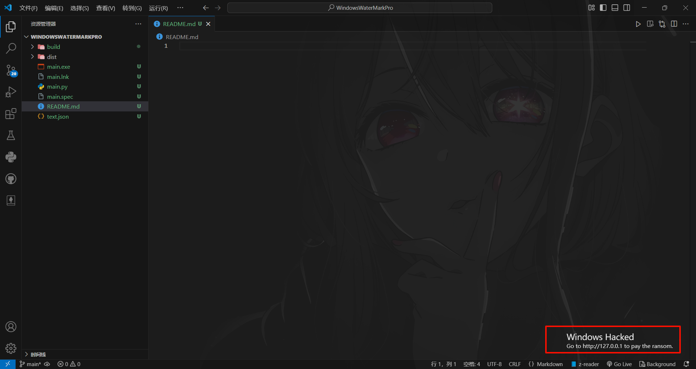

在`text.json`中自定义位置（比例），文案。

旧版使用PySide6进行开发，可进一步更改代码以实现更多个性化功能。

最新版使用C++，Qt，[nlohmann/json](https://github.com/nlohmann/json)编写，VsCode开发环境。

去Release下载

>[!TIP]
> [使用方法](https://github.com/Pfolg/WindowsWaterMark/wiki/Usage)